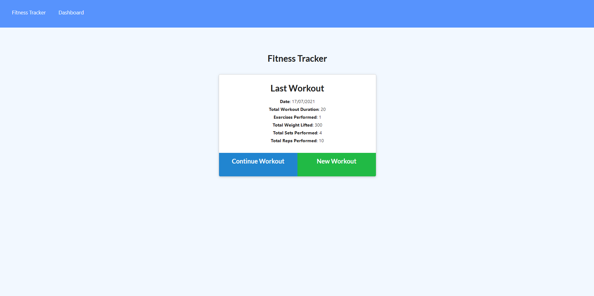
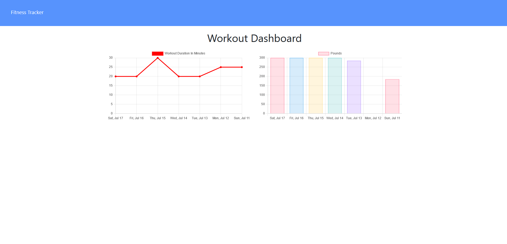

# Workout Tracker

## Description

The workout tracker allows users to log and view their workouts. They can also check their weekly review on the stats page.

Deployed application link: [Workout Tracker](https://nameless-headland-47577.herokuapp.com/)

## Table of Contents

- [Workout Tracker](#workout-tracker)
  - [Description](#description)
  - [Table of Contents](#table-of-contents)
  - [Installation](#installation)
  - [Usage](#usage)
  - [Screenshots](#screenshots)
  - [Tech/framework used](#techframework-used)
  - [Features](#features)
  - [Scripts](#scripts)
  - [Tests](#tests)
  - [Contact](#contact)

## Installation

```
npm install
```

## Usage

Run 'npm run seed' to seed the data to your DB (after creating it), and then run 'npm run start' to use the app.

## Screenshots

Exercise page:


Dashboard:


## Tech/framework used

<b>Built with</b>

- [Node.js](https://nodejs.org/en/)
- [MongoDB](https://www.mongodb.com/)
- [Mongoose](https://mongoosejs.com/)
- [Express](https://expressjs.com/)

## Features

- Log and edit exercises
- Review exercises
- View stats graph on the dashboard

## Scripts

You can use the below scripts to run the app without or with nodemon:

```
npm run start
npm run dev
```

## Tests

N/A

## Contact

For any issues, please contact [my email](mailto:leonwheeler08@gmail.com) 😀
